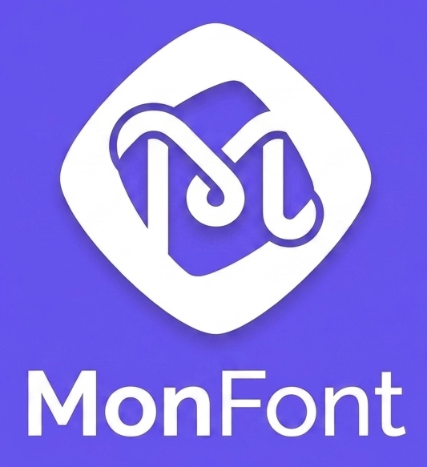

  

# MonFonts // Parametric AI Font Synthesis

MonFonts is an advanced, dynamically generating typographic engine. Bypassing traditional static `.ttf` file limitations, it acts as a master vector environment capable of synthesizing over 500,000 unique font archetypes on demand. 

By passing natural language prompts through the Gemini API, the engine deduces strict typographic and mathematical parameters and programmatically compiles valid OpenType/TrueType binaries in real-time.

## Architecture
* **Brain:** `engine/brain.py` (Gemini API schema generation)
* **Synthesizer:** `engine/glyph_builder.py` & `engine/interpolator.py` (Vector math)
* **Compiler:** `engine/compiler.py` (FontTools binary assembly)
* **Registry:** `src/MonFontsBatchRegistry.sol` (Monad high-frequency ledger)
* **Vault:** `engine/vault.py` (AES-256-GCM Sovereign Storage)

## Initialization
1. Clone the repository.
2. Duplicate `.env.example` to `.env` and insert your API keys.
3. Build the container: `docker-compose build`
4. Run the full environment: `docker-compose up`
